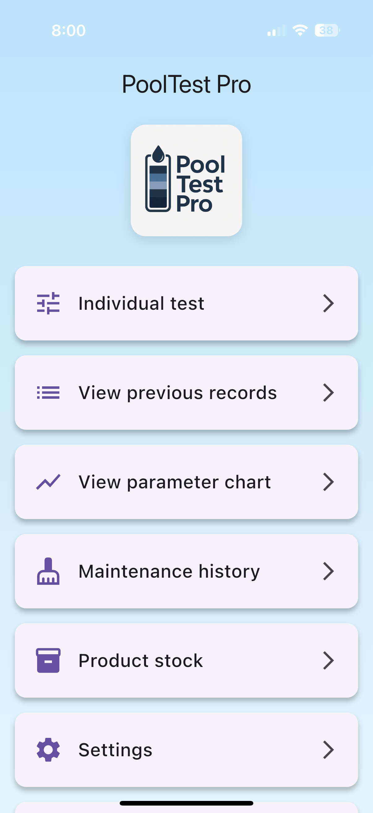
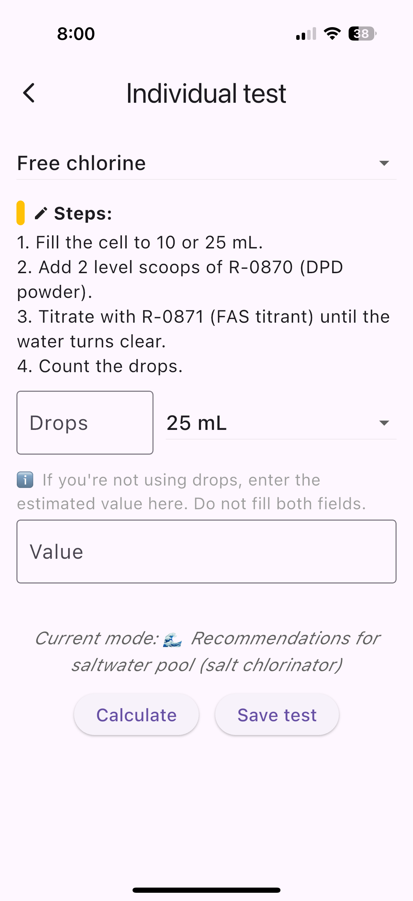
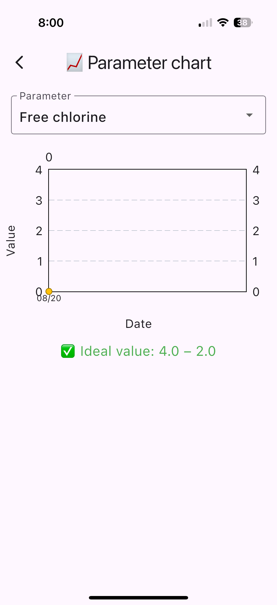
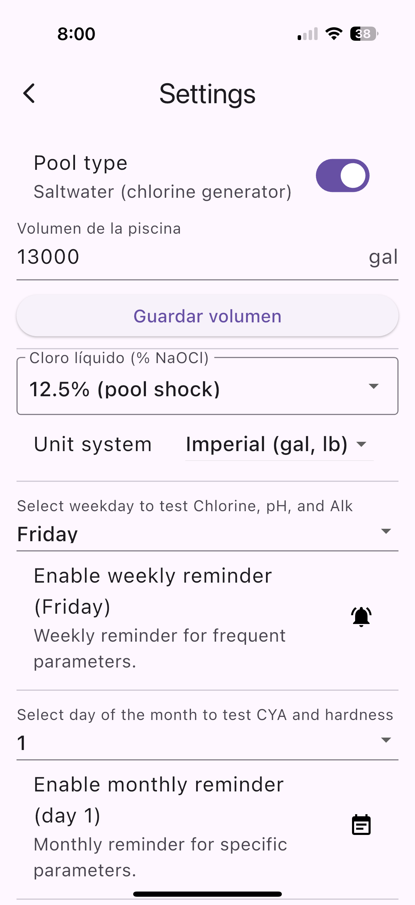

# PoolTest Pro (piscina_app)

**PoolTest Pro** is a Flutter-based mobile app (iOS & Android) designed to help pool owners and technicians test, track, and balance pool water chemistry with professional guidance.  
The app is fully **offline**, bilingual (**English & Spanish**), and optimized for both **saltwater** and **chlorine** pools.

---

## 🌊 Features

- 📊 **Water Testing & Tracking**
  - Free Chlorine / Combined Chlorine  
  - pH, Total Alkalinity, Cyanuric Acid (CYA)  
  - Calcium Hardness, Salinity  

- 🧪 **Smart Recommendations**
  - Commercial products with exact doses (lbs/kg or gal/L)  
  - Guidance for Jandy TruClear salt generator adjustments  
  - Normal ranges shown with ✅ green (ok) / ⚠️ red (low/high)  

- 📱 **Mobile Experience**
  - Works offline — data stored locally on device  
  - Charts & history of test results  
  - Weekly & monthly reminders (via notifications & calendar)  
  - Dark mode and multi-language (EN/ES)  

- 🔒 **Privacy First**
  - No accounts, no analytics, no ads  
  - 100% local storage on device  

---

## 🛠 Tech Stack

- **Flutter** (Dart) — iOS & Android app  
- **SharedPreferences** — local data storage  
- **FL Chart** — visual graphs & parameter tracking  
- **Provider** — state management  
- **AppLocalizations** — full bilingual support (EN/ES)  
- **Site** — static GitHub Pages with SEO, bilingual navigation, unified header & CSS  

---

## 🌐 Official Website

The official site includes support, privacy policy, and marketing overview in **English** and **Spanish**:  

- [Home (EN)](https://martinevoda.github.io/PoolTestPro_app/index.html)  
- [Home (ES)](https://martinevoda.github.io/PoolTestPro_app/index-es.html)  
- [Support](https://martinevoda.github.io/PoolTestPro_app/support.html) · [Soporte](https://martinevoda.github.io/PoolTestPro_app/support-es.html)  
- [Privacy](https://martinevoda.github.io/PoolTestPro_app/privacy.html) · [Privacidad](https://martinevoda.github.io/PoolTestPro_app/privacy-es.html)  
- [Overview](https://martinevoda.github.io/PoolTestPro_app/marketing.html) · [Información](https://martinevoda.github.io/PoolTestPro_app/marketing-es.html)  

---

## 📲 Distribution

- 🔜 App Store (iOS) — version 1.0.0, price **$5.99 USD**  
- 🔜 Google Play (Android)  

---

## 🖼️ App Screenshots

  
  
  
  

---

## 📖 Documentation & Resources

- [Flutter Official Docs](https://docs.flutter.dev/)  
- [Cookbook: Flutter Samples](https://docs.flutter.dev/cookbook)  
- [Add to Calendar plugin](https://pub.dev/packages/add_2_calendar)  
- [Flutter Local Notifications](https://pub.dev/packages/flutter_local_notifications)  

---

# PoolTest Pro (piscina_app)

**PoolTest Pro** is a Flutter-based mobile app (iOS & Android) designed to help pool owners and technicians test, track, and balance pool water chemistry with professional guidance.  
The app is fully **offline**, bilingual (**English & Spanish**), and optimized for both **saltwater** and **chlorine** pools.

---

## 🌊 Features

- 📊 **Water Testing & Tracking**
  - Free Chlorine / Combined Chlorine  
  - pH, Total Alkalinity, Cyanuric Acid (CYA)  
  - Calcium Hardness, Salinity  

- 🧪 **Smart Recommendations**
  - Commercial products with exact doses (lbs/kg or gal/L)  
  - Guidance for Jandy TruClear salt generator adjustments  
  - Normal ranges shown with ✅ green (ok) / ⚠️ red (low/high)  

- 📱 **Mobile Experience**
  - Works offline — data stored locally on device  
  - Charts & history of test results  
  - Weekly & monthly reminders (via notifications & calendar)  
  - Dark mode and multi-language (EN/ES)  

- 🔒 **Privacy First**
  - No accounts, no analytics, no ads  
  - 100% local storage on device  

---

## 🛠 Tech Stack

- **Flutter** (Dart) — iOS & Android app  
- **SharedPreferences** — local data storage  
- **FL Chart** — visual graphs & parameter tracking  
- **Provider** — state management  
- **AppLocalizations** — full bilingual support (EN/ES)  
- **Site** — static GitHub Pages with SEO, bilingual navigation, unified header & CSS  

---

## 🌐 Official Website

The official site includes support, privacy policy, and marketing overview in **English** and **Spanish**:  

- [Home (EN)](https://martinevoda.github.io/PoolTestPro_app/index.html)  
- [Home (ES)](https://martinevoda.github.io/PoolTestPro_app/index-es.html)  
- [Support](https://martinevoda.github.io/PoolTestPro_app/support.html) · [Soporte](https://martinevoda.github.io/PoolTestPro_app/support-es.html)  
- [Privacy](https://martinevoda.github.io/PoolTestPro_app/privacy.html) · [Privacidad](https://martinevoda.github.io/PoolTestPro_app/privacy-es.html)  
- [Overview](https://martinevoda.github.io/PoolTestPro_app/marketing.html) · [Información](https://martinevoda.github.io/PoolTestPro_app/marketing-es.html)  

---

## 📲 Distribution

- 🔜 App Store (iOS) — version 1.0.0, price **$5.99 USD**  
- 🔜 Google Play (Android)  

---

## 🖼️ App Screenshots

  
  
  
  

---

## 📖 Documentation & Resources

- [Flutter Official Docs](https://docs.flutter.dev/)  
- [Cookbook: Flutter Samples](https://docs.flutter.dev/cookbook)  
- [Add to Calendar plugin](https://pub.dev/packages/add_2_calendar)  
- [Flutter Local Notifications](https://pub.dev/packages/flutter_local_notifications)  

---

## 👤 Author

**Martin Vodanovic**  
*Data Analyst · App Developer · Physician*  

- Creator of **PoolTest Pro** (Flutter app + official website)  
- Expertise in **pool maintenance & water chemistry** (Taylor K-2006C test kit, Jandy TruClear salt systems)  
- Background in **data-driven solutions** and **healthcare**  

---

## 📜 License

© 2025 Martin Vodanovic. All rights reserved.  
For personal use only. Commercial redistribution prohibited.
